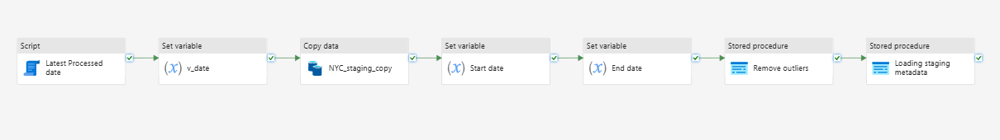
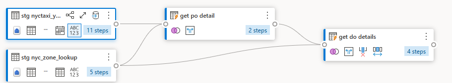
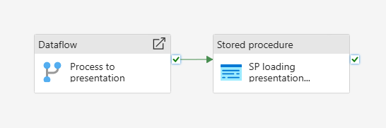
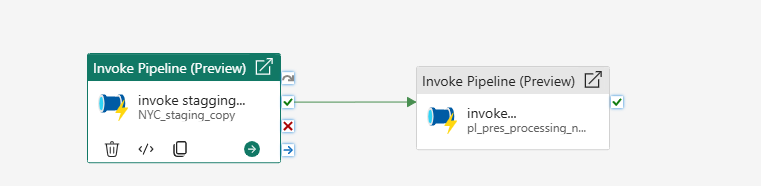

# End-to-End Data Pipeline with Microsoft Fabric (NYC TLC Dataset)

This project demonstrates a complete data ingestion, transformation, and reporting workflow using Microsoft Fabric tools and Power BI. We used NYC TLC trip record data for building a modern data pipeline from Lakehouse to Power BI.

---

## 🚀 Tools & Technologies
- Microsoft Fabric: Lakehouse, Pipelines, Dataflows Gen2, Warehouses
- Power BI: Dashboards and .pbip reports
- SQL & Python: Data transformations and validations

---

## 🔗 Source
NYC TLC Trip Record Data  
[https://www.nyc.gov/site/tlc/about/tlc-trip-record-data.page](https://www.nyc.gov/site/tlc/about/tlc-trip-record-data.page)

---

## 🧱 Project Architecture

1. **Data Ingestion**
   - Downloaded CSV (dimensions) and Parquet (facts) files from NYC TLC portal.
   - Manually uploaded into Lakehouse.

2. **Staging & Initial Pipeline**
   - Used pipelines to move dimension data into the staging warehouse.
   - Ingested one month's fact Parquet file.
   - Stored metadata using SQL stored procedures.
   - Automated the next month's data loading using max date logic.

3. **Cleaning & Presentation Layer**
   - Used Dataflow Gen2 to:
     - Join fact and dimension tables
     - Clean and enrich data
     - Append final output to a Presentation DB
   - Additional stored procedures log pipeline details.

4. **Orchestration**
   - Created a final pipeline to orchestrate both staging and presentation flows.
   - Scheduled the entire process to run monthly.

5. **Reporting**
   - Built Power BI dashboard on top of the Presentation Layer.
   - Dashboard provides KPIs and trip insights.

---

## 📅 Monthly Automation Flow

1. Identify latest date in fact staging.
2. Generate the next month's path dynamically.
3. Ingest and stage data in Warehouse.
4. Clean and join using Dataflow Gen2.
5. Append to Presentation DB.
6. Log process and trigger via scheduled pipeline.

---

## 📸 Screenshots

  

